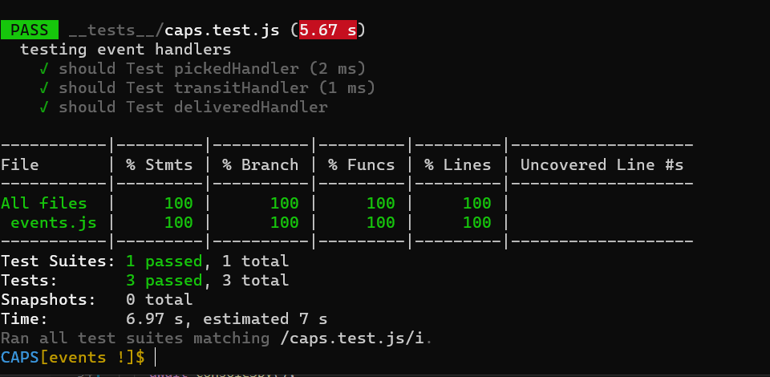
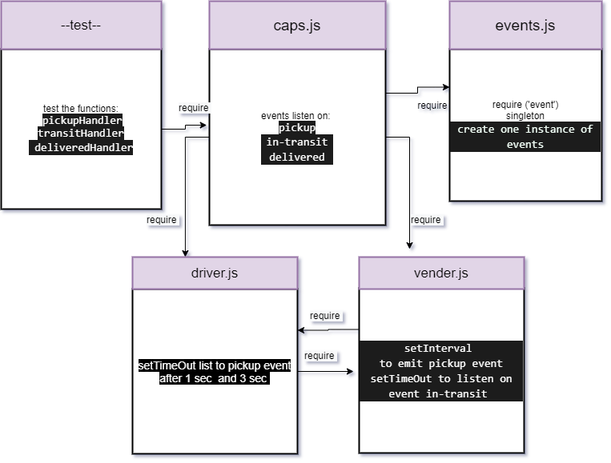

# EVENTS


## Author: As-har Abuhelweh
<hr>

### Tests Reports


[GitHub PR](https://github.com/asharabuhelweh/CAPS/pulls)


[GitHub Actions](https://github.com/asharabuhelweh/CAPS/actions)


### Setup

1. Clone the repo

2. npm install  

3. Create .env file with STORE_NAME


<hr>


### Running the app

`npm start`

<hr>


### Expected Output Objects
```js 

{
  event: 'pickup',
  time: 2021-05-31T00:07:04.443Z,
  payload: {
    store: 'SWEETS',
    orderID: 'da3d10c4-27d4-4495-a230-a0a985716a5f',
    customer: 'Hugh Beer Sr.',
    address: 'Poway,mouth'
  }
}
```
```js

{
  event: 'in-transit',
  time: 2021-05-31T00:07:04.444Z,
  payload: {
    store: 'SWEETS',
    orderID: 'da3d10c4-27d4-4495-a230-a0a985716a5f',
    customer: 'Hugh Beer Sr.',
    address: 'Poway,mouth'
  }
}
```

```js
{
  event: 'delivered',
  time: 2021-05-31T00:07:04.444Z,
  payload: {
    store: 'SWEETS',
    orderID: 'da3d10c4-27d4-4495-a230-a0a985716a5f',
    customer: 'Hugh Beer Sr.',
    address: 'Poway,mouth'
  }
}
```
### Tests


Unit Tests:
 `npm run test`


UML

